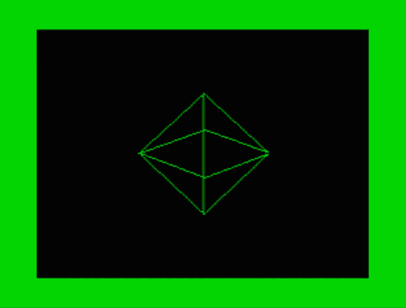
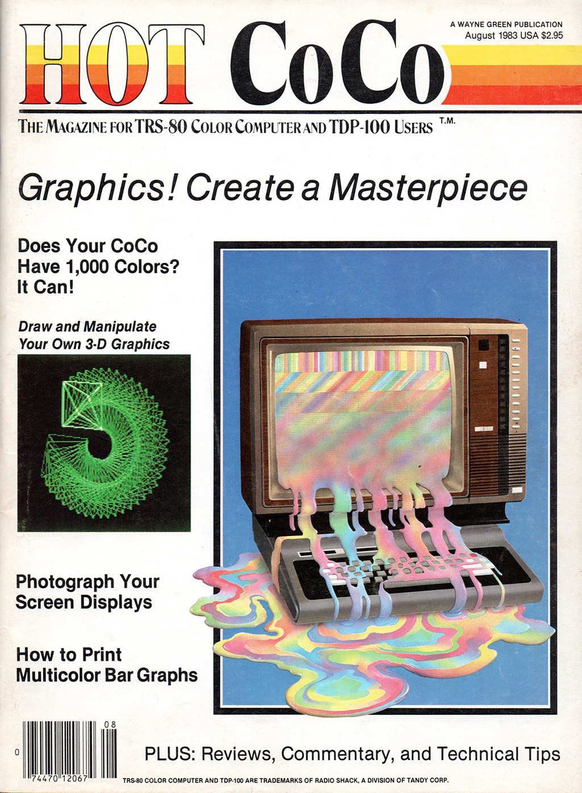

# DISPLAY

### 3D Renderer for the TRS-80 Color Computer

- [Original magazine article](./doc/article.pdf) published in *Hot CoCo* (August 1983)
- [Disk image](./display.dsk) (display.dsk)
- Original [BASIC program](./doc/listing1.bas) (listing 1) and [6809 assembly listing](./doc/listing2.asm) (listing 2)

## Disk Image and Source Code

The [disk image](./display.dsk) contains three versions:

- DISPLAY.BAS / DISPLAY.BIN / DISPLAY.ASM
    - A gently modified version of the original code to make it work with Microsoft Disk BASIC
    - From BASIC, type **RUN "DISPLAY"**

- DISPLAY2.BAS / DISPLAY2.BIN / DISPLAY2.ASM
    - Allows you to rotate about multiple axes simultaneously
    - Moves common variables to the direct page and adds support for the 6309 processor
    - Runs much faster than the original
    - From BASIC, type **RUN "DISPLAY2"**

- DISPLAY3.BAS / DISPLAY3.BIN / DISPLAY3.ASM
    - Requires a Color Computer 3
    - Assembly converted to a modern standard
    - From BASIC, type **RUN "DISPLAY3"**

## To Use

- Mount the disk image and **RUN** one of the three versions
- Type **LOAD"DIAMOND"** and press **ENTER**
- Try: **X**, **Y**, **Z**, **SHIFT-X**, **SHIFT-Y**, **SHIFT-Z**, **ARROW KEYS**, **S** (smaller) and **B** (bigger)
- On the CoCo 3 version, try the **ENTER** key
- To exit display mode, press the **@** key
- Type **HELP** to learn more

## To Modify

Windows development tools and a primitive build script are located at win/build.cmd

## License

All modifications are licensed under the [BSD 3 Clause license](http://opensource.org/licenses/BSD-3-Clause)

***

